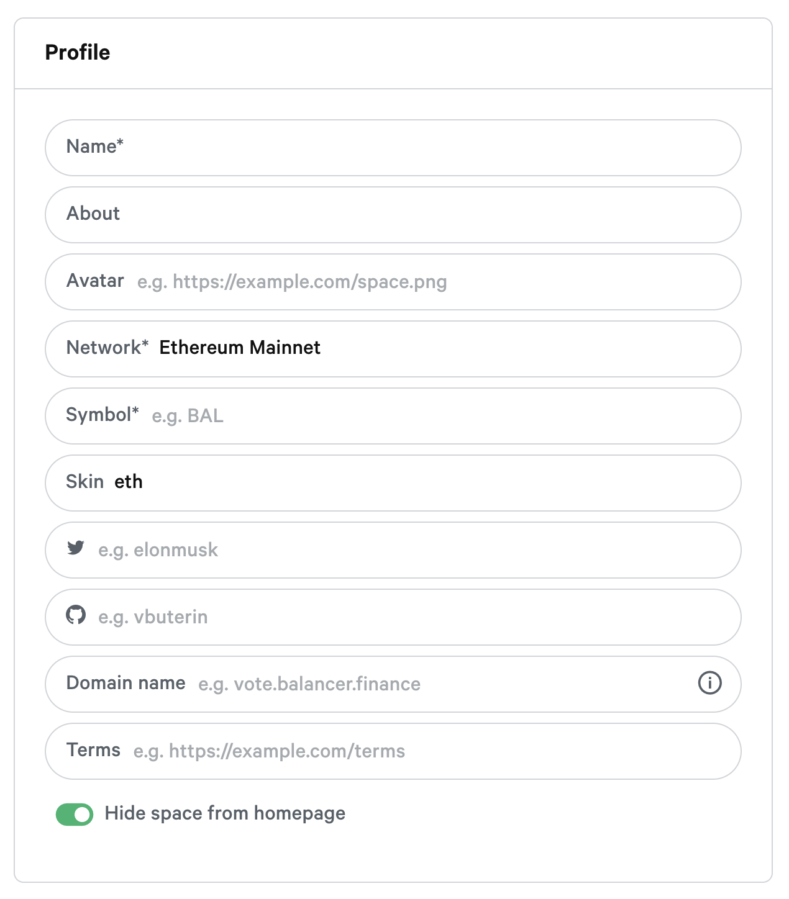
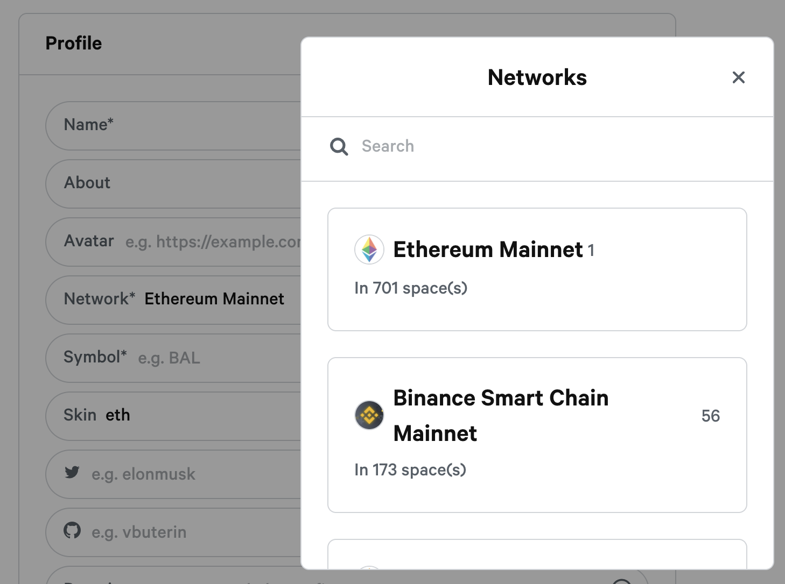
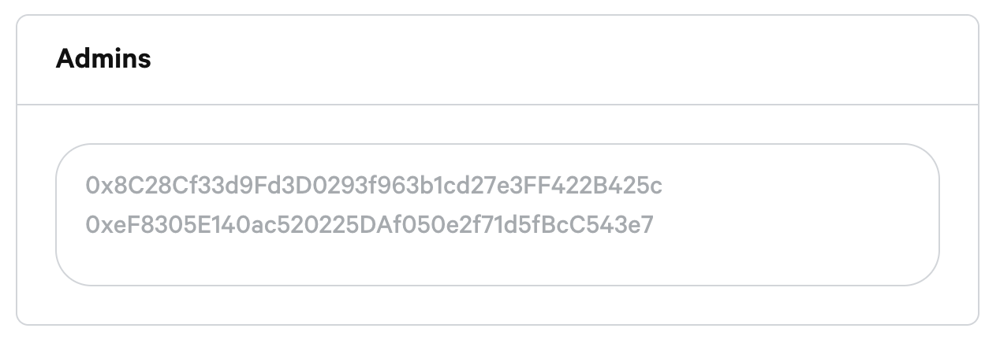

# Create a space


If you already have a space without ENS domain (legacy), you need to [Migrate your space to ENS](https://docs.snapshot.page/spaces/migrate).


### 1. Get an ENS domain for your space

If you haven't already, follow this guide - [https://docs.snapshot.org/spaces/before-creating-your-space](https://docs.snapshot.org/spaces/before-creating-your-space) to get your ENS domain.

Now that you have a ENS address go ahead and setup your space on [snapshot.org](https://snapshot.org/#/setup)

 (2).png>)

### 2. Set ENS text-record

 (1).png>)

Enter the wallet address that you would like to set as the space controller and click "Set controller".&#x20;


You will need to sign a transaction on the Ethereum Mainnet to set the ENS text-record.


### 3. Create space

.png>)

To create your space you will need to enter a name, symbol and selected a network. These settings can be changed in your space settings.

### **4. Customize your space settings**

If you have trouble finding the settings page you can manually navigate to it with the following URL:&#x20;

`https://snapshot.org/#/`**`<ENS DOMAIN>`**`/settings`

#### Profile

* **Name** is the name that will be displayed in your space.
* **About** is the description of your governance purposes.
* **Avatar** is your project logo.
* **Network** must be the network relative to your token.

* **Symbol** is the main token symbol that will be displayed in your space.
* **Skin** can be left as a default, used as an existing one or you can [create your own skin](add-skin.md).

* **Twitter** and **Github** just add a username to link to your different accounts.
* **Domain name** is optional but you can [add a custom domain](add-custom-domain.md).
* **Terms** links to your website's terms and conditions.
* **Hide space from homepage** if you want to keep your space "private".

#### **Strategies**

A strategy is a JavaScript function that defines how the voting power is calculated. You need to add a voting strategy for your proposals. erc20-balance-of is the most used strategy.  You can have multiple strategies and can have your custom strategies as well.&#x20;

You need to add a voting strategy for your proposals. `erc20-balance-of` is the most common strategy.


You can add up to 5 strategies in your space.


Once selected, you can edit the strategy by clicking on it if you want to add your own token.

More information here:


[strategies](../strategies/)


#### Admins

The admins will be able to edit the space settings and moderate proposals. You must add one address per line.

#### Filters

* **Proposal threshold** is the minimum number of tokens required to create a proposal.
* **Proposal validation** is a custom function to validate if someone can post a proposal or not. You can use the basic validation by default which takes your voting power with space strategies and checks if you pass a defined threshold.

**Allow only authors to submit a proposal,** authors will be able to create proposals without being constrained by filters. You must add one address per line. Makes sure that only members specified in authors field are allowed to submit a proposal.&#x20;

####

#### Plugins

Plugins give extra features for your space. More information here:


[plugins](../plugins/)


### 5. Save your settings

Click "**Save**" then confirm the action in your wallet.

You are all set! You can go on `https://snapshot.org/#/<ENS_DOMAIN>` to see your space.

### What you can do now**?**


[add-skin.md](add-skin.md)



[add-custom-domain.md](add-custom-domain.md)

