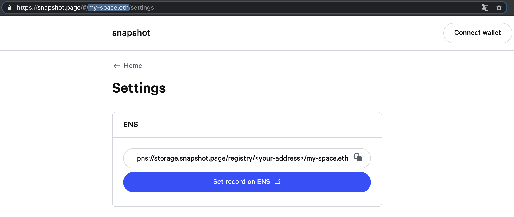

# Create a space with ENS


**If you already have a space with GitHub see how to** [**Migrate your space to ENS**](migrate.md)**.**


## 1. Get an ENS domain for your space

You will need an ENS domain for creating your space, register one here:  
[https://app.ens.domains](https://app.ens.domains/)

If you have never registered an ENS before or need help then checkout this guide:[ https://docs.ens.domains/dns-registrar-guide](https://docs.ens.domains/dns-registrar-guide)

## 2. Link your ENS domain to Snapshot

Once you have created your domain ENS, go on this url using your domain for space name. `https://snapshot.page/#/<SPACE ADDRESS>/settings`


Replace `<SPACE ADDRESS>` with your ENS domain and login with the wallet that owns the domain name.


If you are on your domain space and connected with your wallet you will see the correct **IPNS link** in the **ENS field**. Click on the button **Set record on ENS**, and you will get redirected to ENS page.

* On the ENS page, click on **ADD/EDIT RECORD**
* Select **TEXT** and type the key **"snapshot"**
* Paste the **IPNS link** in the field.
* Click **Save**.
* Scroll down and click **Confirm**
* Sign the transaction with your wallet.

## **3. Setup your space settings**

Refresh the Snapshot settings page `https://snapshot.page/#/<SPACE ADDRESS>/settings` to see the space setting.

### Profile

* **Change avatar** to have your [logo and strategy images in your space](add-avatar.md#add-your-space-logo-and-strategy-image-s).
* **Name** is the name that will be displayed in the snapshot application.
* **Network** must be the network relative to your token.
* **Symbol** is the main token symbol that will be displayed in your space.
* **Skin** can be left as a default, used as an existing one or you can [create your own skin](add-skin.md#add-your-skin).
* **Domain name** is optional but you can [add a custom domain](add-custom-domain.md#add-a-custom-domain).

### **Strategies**

You need to add a voting strategy for your proposals. `erc20-balance-of` is chosen by default and you can click on it to add your own token address.

More information here:




You can add up to 3 strategies in your space.


### Members and Filters

* **Members** are those who can create official proposals that will be displayed in the "Core" tab. You can add as many addresses as you need, one per line.
* **Default tab** is the one that will be displayed as the default for your space. For example `all` `core` or `community`
* **Minimum score** is the minimum number of tokens required to create a proposal.
* **Only members proposals** is used to allow only members to post proposals and can be set to `true` or `false`
* **Invalids** are the proposals you want to hide from your space. You can add as many proposal ids as you need, one per line.

Click **Save** and **sign settings message** on your wallet.

Now you are set! You can go on `https://snapshot.page/#/<SAPCE ADDRESS>` to see your space.


When you create or edit a space, it take about 3min to see the changes live.


## What you should do now**?**







